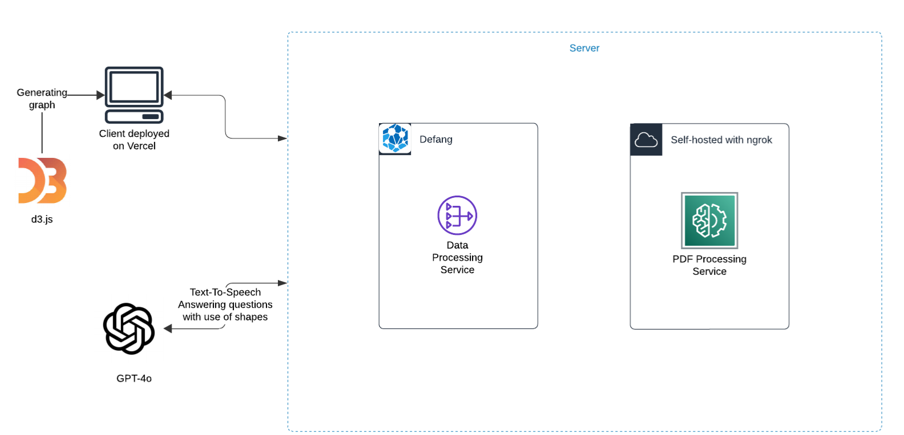

# SlideProf


An AI that can draw while answering your toughest questions!

## What does it do?

Basically, you upload your lecture slides, drag and drop your most confusing parts, and SlideProf will answer while drawing and writing directly on your slides!

## Demo

Check out our demo on YouTube to see SlideProf in action:

[](https://www.youtube.com/watch?v=89Nrt4tXoJI)

## Installation

### Backend (`server` folder)
1. Navigate to the `server` directory:
  ```sh
  cd server
  ```
2. Create a virtual environment:
  ```sh
  python -m venv venv
  ```
3. Activate the virtual environment:
  - On Windows:
    ```sh
    venv\Scripts\activate
    ```
  - On macOS/Linux:
    ```sh
    source venv/bin/activate
    ```
4. Install the required dependencies:
  ```sh
  pip install -r requirements.txt
  ```

### Backend (`model` folder)
1. Navigate to the `model` directory:
  ```sh
  cd model
  ```
2. Create a virtual environment:
  ```sh
  python -m venv venv
  ```
3. Activate the virtual environment:
  - On Windows:
    ```sh
    venv\Scripts\activate
    ```
  - On macOS/Linux:
    ```sh
    source venv/bin/activate
    ```
4. Install the required dependencies:
  ```sh
  pip install -r requirements.txt
  ```

### Frontend (`client` folder)
1. Navigate to the `client` directory:
  ```sh
  cd client
  ```
2. Install the required dependencies:
  ```sh
  npm install
  ```

### Running the Development Server
1. Start the backend server:
  ```sh
  cd model
  # Ensure the virtual environment is activated
  python app.py
  ```
2. Start the frontend development server:
  ```sh
  cd client
  npm run dev
  ```

Now, you should have both the backend and frontend servers running for development.

## Architecture

Here's a high-level overview of the SlideProf architecture:



The architecture consists of three main components:

1. **Frontend (Client)**: Built with modern web technologies, it provides an intuitive interface for users to interact with SlideProf.

2. **Backend (Server)**: Handles the core logic, including processing user requests, managing data, and serving the AI model's predictions. It acts as a glue sticking the frontend with the model, making sure that user inputs are correctly processed and that the model's outputs are appropriately formatted and sent back to the frontend.

3. **Model**: The AI component that performs the drawing and answering tasks, leveraging advanced machine learning techniques. The model processes the input data, scans the surrounding area to make sure there is space to draw, and then generates the necessary visual and textual explanations, and sends them back to the backend for further processing and delivery to the frontend.

Each component communicates seamlessly to deliver a smooth and efficient user experience.

## Members

- **[Bao Dang](https://github.com/weebao)**
- **[Eric Vasquez](https://github.com/evasquez25)**
- **[Hung Nguyen](https://github.com/HungNT1st)**
- **[Vu Nguyen](https://github.com/Quinichin)**

